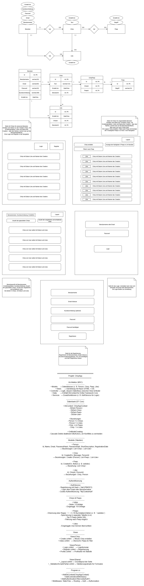

# ChirpApp

ChirpApp ist eine Social-Media-Webanwendung, bei der Benutzer kurze Nachrichten („Chirps“) erstellen und mit anderen interagieren können.

Die Anwendung wurde mit ASP.NET Core MVC entwickelt und unterstützt Registrierung, Login sowie verschiedene Interaktionsmöglichkeiten.

---

## Funktionen

### Benutzer

- Registrierung mit:
  - E-Mail-Adresse
  - Benutzername (max. 16 Zeichen, nur Buchstaben und Zahlen)
  - Passwort
- Optional: Kurzbeschreibung (max. 300 Zeichen)
- Login mit E-Mail oder Benutzername

---

### Chirps (Beiträge)

- Erstellen von kurzen Nachrichten (max. 123 Zeichen)
- Anzeige:
  - 5 neueste Chirps für anonyme Benutzer
  - 10 neueste Chirps für eingeloggte Benutzer
- Anzeige von:
  - Benutzername
  - Inhalt
  - Erstellungsdatum

---

### Likes

- Chirps können geliked und entliked werden

---

### Peeps (ähnlich Hashtags)

- Markierung von Begriffen im Text
- Speicherung und Filterung von Peeps
- Anzeige der 5 häufigsten Peeps der letzten 24 Stunden
- Nur gültig wenn:
  - 3–16 alphanumerische Zeichen
  - keine Sonderzeichen

---

### Filter

- Chirps können nach bestimmten Peeps gefiltert werden

---

### Benutzerprofile

- Anzeige von:
  - Benutzername
  - Beschreibung
  - Registrierungsdatum
- Statistiken:
  - Anzahl der Chirps
  - vergebene Likes
  - erhaltene Likes
- Anzeige der letzten 5 Chirps eines Benutzers

---

## Technologien

- C#
- ASP.NET Core MVC
- Entity Framework Core
- SQL-Datenbank
- Cookie-basierte Authentifizierung

---

## Datenbankdiagramm

---

## Hinweis

Dieses Projekt wurde als Lernprojekt im Rahmen einer praxisnahen Aufgabenstellung erstellt.
